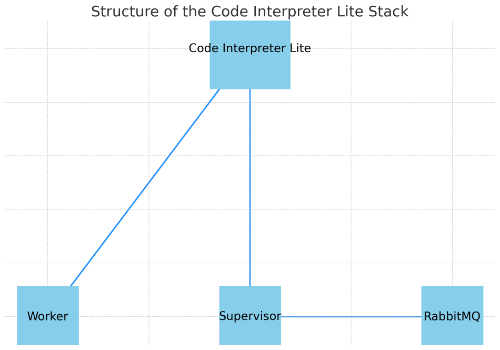

# Code Interpreter Lite


An experimental client that uses LLMs with [docker-python-sandbox-supervisor](https://github.com/uetuluk/docker-python-sandbox-supervisor) and [docker-python-sandbox](https://github.com/uetuluk/docker-python-sandbox) to run python code in a sandboxed environment.

While the current version only works with GPT API, the goal is to make it work with any LLMs, especially local ones like LLaMA2. 


## Project Structure



## Running

### Requirements

1. [Docker](https://docs.docker.com/get-docker/) 
   
### Setting Up

1. Clone the repo
2. Download/build all the required images. Check the [docker-python-sandbox-supervisor](https://github.com/uetuluk/docker-python-sandbox-supervisor) and [docker-python-sandbox](https://github.com/uetuluk/docker-python-sandbox) for guides on how to build those images. The Code Interpreter Lite application can be built by running the following command.
   ```bash
    build-production-image
   ```
3. After you have all the images ready, you can run the following command to set up the Code Interpreter Lite stack.
   ```bash
   make full-detached
   ```

The application will be available at http://localhost:7860.

## Development

### Requirements

1. [Docker](https://docs.docker.com/get-docker/)
2. Python 3.10 or higher (Tested on 3.10.4 and 3.10.12)

### Setting Up

1. Clone the repo
2. Run the following command to set up the development environment.
   ```bash
   make build-development-environment
   ```
3. Run the following command to start the development environment.
   ```bash
   make develop
   ```

The application will be available at http://localhost:7860.

## TODO
- [ ] More reliable handling of files - Currently, the LLMs get confused about how to access the files
- [ ] Add support for local LLMs - LLaMa does not use the correct format, therefore the code cannot be run.
- [ ] Add support for Claude from Antrophic - Currently Claude gets stuck running the code again and again until it times out.